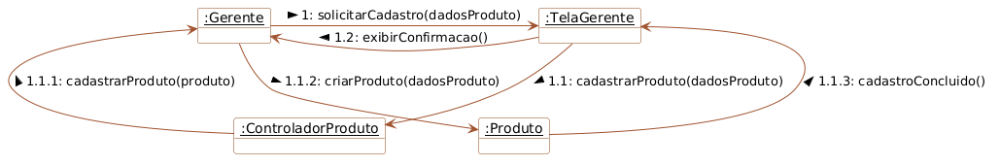
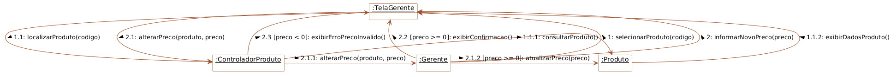
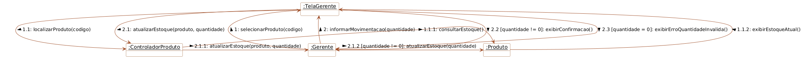
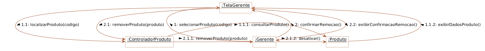
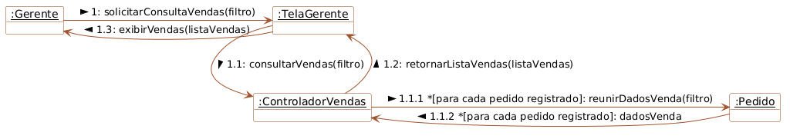

# Semana 10 — Diagramas de Comunicação

Esta pasta contém os cinco diagramas de comunicação dos casos de uso disparados pelo Gerente no Sistema de Vendas da Cantina Escolar:

1. Cadastrar Produto

2. Alterar Preço

3. Atualizar Estoque

4. Remover Produto

5. Consultar Vendas

Os diagramas seguem o estilo do exemplo fornecido pelo professor: objetos, links com mensagens direcionadas, numeração hierárquica, guardas e iteração indicadas nas mensagens.
