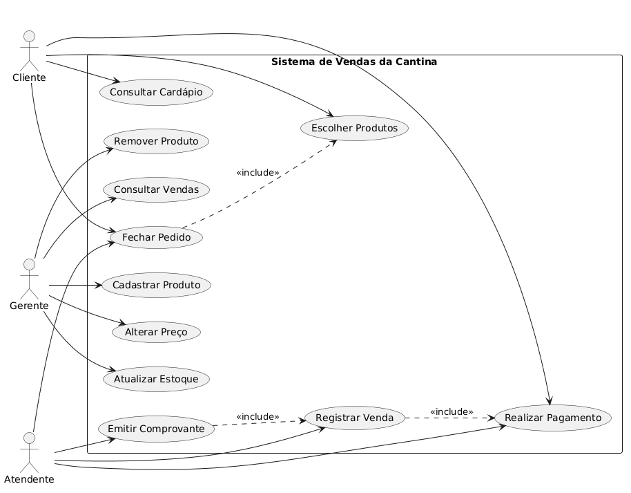
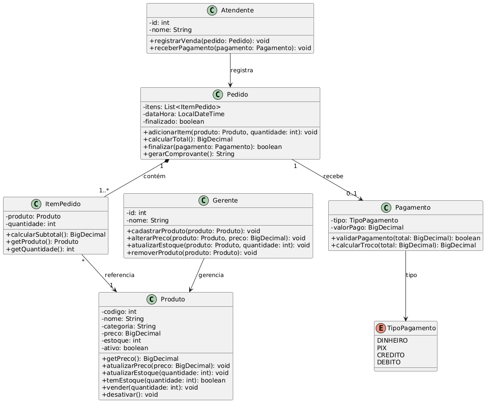

# Sistema de Vendas da Cantina Escolar

## 1. Casos de Uso

### Atores
- Cliente
- Atendente
- Gerente

### Principais funcionalidades
- Consultar cardápio
- Realizar venda
- Realizar pagamento
- Emitir comprovante
- Gerenciar produtos
- Atualizar estoque
- Consultar vendas

## 2. Tarefa 01 - Diagrama de Casos de Uso

## 3. Tarefa 02 - Diagrama de Classes

## 4. Tarefa 03 - Implementação em Java

O sistema foi implementado em Java, utilizando as classes
Produto, ItemPedido, Pedido e Pagamento.